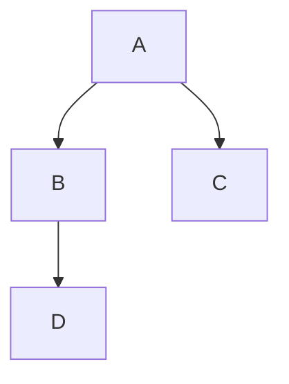

# Test 2 :)

## This is paragraph 1

This is a sentence.  
___this is italic bold___

- [ ] item 1
- [X] item 2

BOOOOOOOOOOOOOOOOOOOOOOOOOOO

## Images:

_image source_.[^1]

## This should be a remote image:


## This is paragraph 2

Bash snippet:
```sh
echo '12'
ls -la /home/user 2>&1
```

Python snippet:
```py
def foo():
    print("?", 12)
```

## This is a mermaid

The original script:
```text
graph TD;
    A-->B;
    A-->C;
    B-->D;
```

The output:


### FootNotes
[^1]: <https://hdqwalls.com/wallpaper/1920x1080/8-bit-artwork-house-island-in-middle-of-water>
